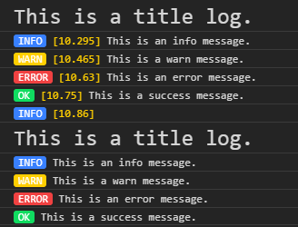

# Nice Logs



[Website](https://domske.github.io/nice-logs/)

A pretty nice, colorful and lightweight console log for the browser.
Prints a line with log type and high resolution time stamp. With integrated TypeScript type definitions.

## Install

```text
npm i nice-logs
```

[NPM Package](https://www.npmjs.com/package/nice-logs)

## Usage

```ts
Log.title('This is a title log.');
Log.info('This is an info message.');
Log.warn('This is a warn message.');
Log.error('This is an error message.');
Log.success('This is a success message.');

// How to replace `console.log(...)`?
Log.info('...');

// Just log time.
Log.info();

// Do not log time.
Log.timeStampEnabled = false;
Log.info('No time stamp here.');

// I want to use own style. (Experimental)
Log.logStyle.info = 'color: blue';
Log.modeText.info = 'LOL';
Log.info('Hehe');
```

## Troubleshoot

This should work with all Chromium browsers like Chrome, Opera and the "new" Edge browser. (The Edge with Chromium. The old one does not support it.) It also works with Firefox. Not tested in Safari. NodeJS is not supported. Maybe in the future.
